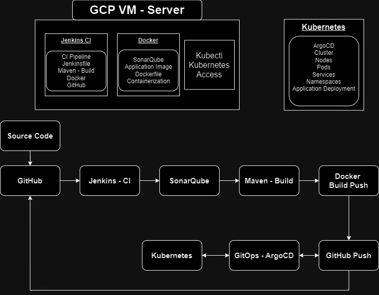
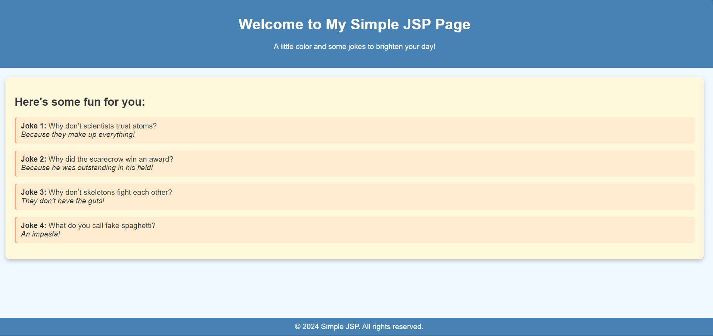

# **CI/CD Pipeline Deployment on GCP with Jenkins, Docker, Kubernetes, and GitOps ArgoCD**

## **Tools/Technologies Used**
- **Cloud:** GCP (Google Cloud Platform), Google Cloud SDK  
- **CI/CD Tools:** Jenkins, SonarQube, GitOps - ArgoCD
- **Version Control & Automation:** GitHub
- **Containerization & Orchestration:** Docker, Kubernetes, Kubectl  
- **Languages/Frameworks:** Java, Maven

  

---

## **Project Overview**

This project demonstrates the development and deployment of a complete CI/CD pipeline on a GCP Virtual Machine (VM) using Jenkins for build automation, Docker for containerization, and Kubernetes for orchestration. The pipeline includes integration with SonarQube for code quality analysis and ArgoCD for GitOps-driven continuous deployment.

---

## **Setup & Installation**

### **1. GCP VM Setup**
- Created a GCP VM with the following specifications:
  - 4 CPUs, 16GB RAM, 30GB Disk
- Connected to the VM using SSH via MobaXterm.

### **2. Jenkins Installation and Configuration**
- Installed Jenkins on the GCP VM and accessed it via port `8080`.
- Configured Jenkins with necessary credentials, Maven, and plugins (Pipeline Stageview, Docker).
- Created a Groovy pipeline script with the following stages:
  - **Checkout:** Pulled source code and Dockerfile from GitHub.
  - **SonarQube:** Integrated with SonarQube for static code analysis.
  - **Maven Build:** Compiled and built the Java application.
  - **Docker Build & Push:** Built the Docker image and pushed it to DockerHub.
  - **GitOps:** Pushed updates to GitHub to trigger ArgoCD sync.

### **3. SonarQube Setup**
- Deployed SonarQube in a Docker container.
- Accessed SonarQube via port `9000` and generated security tokens.
- Integrated SonarQube with Jenkins for automated code quality checks.

### **4. Kubernetes Cluster Setup**
- Created a Kubernetes cluster with 4 nodes on GKE (Google Kubernetes Engine).
- Managed the cluster using `Kubectl` and Google Cloud SDK.

### **5. ArgoCD Installation & GitOps Configuration**
- Installed ArgoCD on the Kubernetes cluster using `kubectl`.
- Configured ArgoCD to sync with the GitHub repository for continuous deployment.
- Exposed ArgoCD using a LoadBalancer service and accessed it via the external IP.
- Set up ArgoCD to automatically sync and deploy the application from GitHub.

---

## **Pipeline Workflow**

1. **Code Commit:** Source code, Dockerfile, and Kubernetes manifests are pushed to GitHub.
2. **Jenkins Pipeline:**
   - **Checkout:** Jenkins pulls the latest code from GitHub.
   - **SonarQube Scan:** Jenkins runs SonarQube for code quality analysis.
   - **Maven Build:** Jenkins builds the Java application.
   - **Docker Build:** Jenkins builds the Docker image using the Dockerfile.
   - **Push to DockerHub:** Jenkins pushes the built image to DockerHub.
   - **GitOps Sync:** Jenkins pushes configuration changes back to GitHub for ArgoCD.
3. **ArgoCD Deployment:** ArgoCD automatically syncs and deploys the new application version to the Kubernetes cluster.
4. **Live Application:** The application is live and accessible via the external IP of the Kubernetes service.

---

## **Outcome**
- Fully automated CI/CD process from code commit to deployment on a Kubernetes cluster.
- Continuous monitoring and quality checks using SonarQube.
- Seamless container orchestration with Kubernetes and automated GitOps-based deployments via ArgoCD.

---

## **Useful Links**
- [Jenkins Installation](https://www.jenkins.io/doc/book/installing/linux/#debianubuntu)
- [Docker Installation](https://docs.docker.com/engine/install/debian/#uninstall-docker-engine)
- [Kubectl Installation](https://kubernetes.io/docs/tasks/tools/install-kubectl-linux/#before-you-begin)
- [GCloud SDK Installation](https://cloud.google.com/sdk/docs/install)
- [ArgoCD Installation](https://argo-cd.readthedocs.io/en/stable/getting_started/)

---

## **Commands Used**

### **Jenkins Installation**
```bash
sudo wget -O /usr/share/keyrings/jenkins-keyring.asc https://pkg.jenkins.io/debian-stable/jenkins.io-2023.key
echo "deb [signed-by=/usr/share/keyrings/jenkins-keyring.asc] https://pkg.jenkins.io/debian-stable binary/" | sudo tee /etc/apt/sources.list.d/jenkins.list > /dev/null
sudo apt-get update
sudo apt-get install jenkins
```

### **Docker Installation**
```bash
sudo apt-get update
sudo apt-get install ca-certificates curl
sudo install -m 0755 -d /etc/apt/keyrings
sudo curl -fsSL https://download.docker.com/linux/debian/gpg -o /etc/apt/keyrings/docker.asc
sudo chmod a+r /etc/apt/keyrings/docker.asc
echo "deb [arch=$(dpkg --print-architecture) signed-by=/etc/apt/keyrings/docker.asc] https://download.docker.com/linux/debian $(. /etc/os-release && echo "$VERSION_CODENAME") stable" | sudo tee /etc/apt/sources.list.d/docker.list > /dev/null
sudo apt-get update
sudo apt-get install docker-ce docker-ce-cli containerd.io docker-buildx-plugin docker-compose-plugin
sudo usermod -aG docker jenkins 
sudo systemctl restart docker 
sudo chmod 666 /var/run/docker.sock
```
### **Kubectl Installation**
```bash
curl -LO "https://dl.k8s.io/release/$(curl -L -s https://dl.k8s.io/release/stable.txt)/bin/linux/amd64/kubectl"
curl -LO "https://dl.k8s.io/release/$(curl -L -s https://dl.k8s.io/release/stable.txt)/bin/linux/amd64/kubectl.sha256"
echo "$(cat kubectl.sha256)  kubectl" | sha256sum --check
sudo install -o root -g root -m 0755 kubectl /usr/local/bin/kubectl
kubectl version --client
```
### **Accessing Cluster from Terminal**
```bash
#Google Cloud SDK Installation
sudo apt-get update
sudo apt-get install apt-transport-https ca-certificates gnupg curl
curl https://packages.cloud.google.com/apt/doc/apt-key.gpg | sudo gpg --dearmor -o /usr/share/keyrings/cloud.google.gpg
echo "deb [signed-by=/usr/share/keyrings/cloud.google.gpg] https://packages.cloud.google.com/apt cloud-sdk main" | sudo tee -a /etc/apt/sources.list.d/google-cloud-sdk.list
sudo apt-get update && sudo apt-get install google-cloud-cli
#Login to GCloud
glcoud auth login
#Install gcloud-auth plugin
sudo apt-get install google-cloud-cli-gke-gcloud-auth-plugin
#connect cluster
gcloud container clusters get-credentials app-cluster --zone us-central1-c --project sincere-charmer-431710-v6
```

### **Argo CDInstallation**
```bash
kubectl create namespace argocd
kubectl apply -n argocd -f https://raw.githubusercontent.com/argoproj/argo-cd/stable/manifests/install.yaml
kubectl patch svc argocd-server -n argocd -p '{"spec": {"type": "LoadBalancer"}}'
kubectl get svc argocd-server -n argocd
```
